# Agentic RAG Course Planning & Knowledge Copilot

A robust RAG (Retrieval-Augmented Generation) system designed for enterprise knowledge management and intelligent course planning. This project provides an asynchronous document ingestion pipeline, conversational querying, semantic search, and structured planning using LLMs. It features a scalable backend with worker queues and a thin Streamlit frontend for demonstration.

## 🚀 Key Features

*   **Document Ingestion**: Supports uploading PDF, Markdown, HTML, and TXT files.
*   **Asynchronous Processing**: Uses Redis-backed queues for background processing (parsing, chunking) to handle large volumes of documents without blocking the API.
*   **Vector Embeddings**: Background worker logic for generating embeddings utilizing models from OpenAI and Voyage AI.
*   **Conversational Agent**: Context-aware Q&A based on uploaded documents.
*   **Course Planning & Eligibility**: Agentic reasoning to evaluate curriculum prerequisites, plan future terms, and check enrollment eligibility.
*   **Streamlit UI**: Thin wrapper UI testing the underlying APIs for free-form query, eligibility, and recommendation flows.
*   **Scalable Architecture**:
    *   **FastAPI**: High-performance API for ingestion, querying, reasoning, and status checks.
    *   **PostgreSQL + pgvector**: Relational data, document metadata, and vector similarity search.
    *   **MinIO**: S3-compatible object storage for raw document files.
    *   **Redis**: High-performance task queue (job processing).

## 🛠️ Tech Stack

*   **Language**: Python 3.11
*   **Web Framework**: FastAPI (Backend) / Streamlit (Frontend)
*   **Database**: PostgreSQL 15, SQLAlchemy (ORM), pgvector (Vector Store)
*   **Storage**: MinIO (S3 Compatible)
*   **Task Queue**: Redis
*   **Containerization**: Docker & Docker Compose

## 📂 Project Structure
```text
llmops/
├── app/
│   ├── api/            # FastAPI Endpoints (ingest, retrieve, query, planning)
│   ├── core/           # Configuration & Settings
│   ├── db/             # Database Models & Session Management
│   ├── embeddings/     # Embeddings worker (OpenAI/Voyage AI integrations)
│   ├── indexing/       # Search index generation
│   ├── ingestion/      # Document ingestion logic, parsers, minio storage
│   ├── planning/       # Course planning logic & reasoning
│   ├── query/          # Query synthesis and LLM completion
│   ├── reasoning/      # Core logic algorithms
│   ├── rerank/         # Post-retrieval reranking algorithms
│   └── retrieval/      # Vector and hybrid search logic
├── docker/             # Dockerfiles for API and Workers
├── alembic/            # Database Migrations
├── data/               # Local data/fixtures
├── streamlit_app.py    # Streamlit UI Entrypoint
├── docker-compose.yml  # Orchestration
└── requirements.txt    # Python Dependencies
```

## ❄️ Project Flow

```mermaid
    sequenceDiagram
    actor User as User
    participant Streamlit as Streamlit App
    participant API as FastAPI Backend
    participant DB as PostgreSQL + pgvector
    participant MinIO as MinIO Storage
    participant Redis_Q as Redis Queue
    participant Workers as Async Workers
    participant LLM as External APIs (OpenAI/Voyage)

    %% HTTP API REQUEST
    rect rgb(20, 40, 60)
    Note over User, Streamlit: Streamlit Frontend Interaction
    User->>Streamlit: Request (Upload / Query / Plan)
    Streamlit->>API: HTTP Request (POST /ingest, /query, /plan)
    end
    
    %% Ingestion Flow
    rect rgb(60, 40, 20)
    Note over API, MinIO: Document Ingestion Flow
    API->>MinIO: Store raw file
    API->>DB: Record document & version status
    API->>Redis_Q: Enqueue chunking/parsing job
    Workers->>Redis_Q: Dequeue and process
    Workers->>DB: Store parsed chunks
    Workers->>Redis_Q: Enqueue embedding job
    Workers->>LLM: Generate vectors
    Workers->>DB: Store embeddings in pgvector
    end
    
    %% Query Flow
    rect rgb(20, 60, 40)
    Note over API, LLM: RAG & Agentic Planning Flow
    API->>DB: Semantic search (vector comparison)
    DB-->>API: Relevant context
    API->>LLM: Generate final structured response / plan
    API-->>Streamlit: JSON response with citations
    Streamlit-->>User: Rendered Response
    end
```


## 🔑 Environment Variables

The project relies on a `.env` file at the root directory to configure the database, storage, queues, and external APIs. You must create this file before starting the application.

Required keys (DO NOT commit their values):

```env
# MinIO Storage Configuration
MINIO_ROOT_USER=
MINIO_ROOT_PASSWORD=
MINIO_ENDPOINT=
MINIO_ACCESS_KEY=
MINIO_SECRET_KEY=

# Redis Queue Configuration
REDIS_HOST=
REDIS_PORT=

# PostgreSQL / pgvector Database Configuration
POSTGRES_USER=
POSTGRES_PASSWORD=
POSTGRES_DB=
POSTGRES_HOST=
POSTGRES_PORT=

# AI Model Provider Keys
OPENAI_API_KEY=
VOYAGE_API_KEY=

# Vector Database Selection (e.g., pgvector)
VECTOR_BACKEND=
```

## 🏁 Getting Started

### Prerequisites

*   [Docker](https://www.docker.com/) installed on your machine.
*   [Docker Compose](https://docs.docker.com/compose/) installed.
*   Valid API keys for OpenAI (and optionally Voyage AI) placed inside your `.env` file.

### Installation & Running

1.  **Clone the repository**:
    ```bash
    git clone <repository-url>
    cd llmops
    ```

2.  **Environment Configuration**:
    Create a `.env` file in the root directory and populate it with the fields listed above in the Environment Variables section. _(See `docker-compose.yml` for internal container default mappings)_.

3.  **Start Services**:
    Run the following command to build and start the API, Worker, Embeddings Worker, PostgreSQL, Redis, and MinIO:
    ```bash
    docker-compose up --build
    ```

4.  **Launch the Streamlit App** (Optionally run the UI directly on localhost):
    ```bash
    pip install streamlit requests
    streamlit run streamlit_app.py
    ```
    Alternatively, if Streamlit is baked into another container/setup, simply ensure the required python dependencies are active in your environment before executing it.

5.  **Access Components**:
    *   **Streamlit UI**: [http://localhost:8501](http://localhost:8501) (Default port)
    *   **FastAPI Docs**: [http://localhost:8000/docs](http://localhost:8000/docs)
    *   **MinIO Console**: [http://localhost:9001](http://localhost:9001)

## 🔌 Core API Endpoints

### 1. Upload a Document
*   **Endpoint:** `POST /ingest/upload`
*   **Description:** Upload documents asynchronously to MinIO and trigger chunking and embedding generation jobs.

### 2. Check Ingestion Status
*   **Endpoint:** `GET /ingest/status/{version_id}`
*   **Description:** Fetch document processing job statuses.

### 3. Agentic Query
*   **Endpoint:** `POST /query`
*   **Description:** Natural language query answering utilizing context from ingested documents.

### 4. Course Planning
*   **Endpoint:** `POST /plan/courses`
*   **Description:** Evaluates eligibility and recommends course terms conditionally based on past credits/grades.
