# Enterprise Engineering Knowledge Copilot

A robust RAG (Retrieval-Augmented Generation) system designed for enterprise knowledge management. This project provides an asynchronous document ingestion pipeline, supporting multiple formats, version control, and scalable storage.

## 🚀 Key Features

*   **Document Ingestion**: Supports uploading PDF, Markdown, HTML, and TXT files.
*   **Asynchronous Processing**: Uses Redis-backed queues for background processing to handle large volumes of documents without blocking the API.
*   **Versioning**: Tracks document versions, status (queued, processing, done, failed), and history.
*   **Scalable Architecture**:
    *   **FastAPI**: High-performance API for ingestion and status checks.
    *   **PostgreSQL + pgvector**: Relational data and vector similarity search.
    *   **MinIO**: S3-compatible object storage for raw document files.
    *   **Redis**: High-performance task queue.

## 🛠️ Tech Stack

*   **Language**: Python 3.11
*   **Web Framework**: FastAPI
*   **Database**: PostgreSQL 15, SQLAlchemy (ORM), pgvector (Vector Store)
*   **Storage**: MinIO (S3 Compatible)
*   **Task Queue**: Redis
*   **Containerization**: Docker & Docker Compose

## 📂 Project Structure
```
llmops/
├── app/
│   ├── api/            # API Endpoints (Upload, Status)
│   ├── core/           # Configuration & Settings
│   ├── db/             # Database Models & Session Management
│   ├── ingestion/      # Worker Logic, Queue, & Storage Wrappers
│   └── main.py         # App Entrypoint
├── docker/             # Dockerfiles for API and Worker
├── alembic/            # Database Migrations
├── docker-compose.yml  # Orchestration
└── requirements.txt    # Python Dependencies
```
## ❄️ Project Flow

```mermaid
    sequenceDiagram
    actor User as User (cURL / Browser)
    participant API as app/api/routes/ingest.py
    participant DB as PostgreSQL (app/db/models/*)
    participant MinIO as MinIO Storage (app/ingestion/storage.py)
    participant R_Ingest as Redis Queue (ingest:jobs)
    participant W_Ingest as app/ingestion/worker.py
    participant R_Embed as Redis Queue (embed:jobs)
    participant W_Embed as app/embeddings/worker.py
    participant OpenAI as External API (provider.py)

    %% --- PHASE 1: HTTP API REQUEST ---
    rect rgb(20, 40, 60)
    Note over User, API: Phase 1: API Upload (Fast response)
    
    User->>API: POST /ingest/upload (File + Metadata Form Data)
    activate API
    
    API->>API: Read file bytes into memory
    API->>MinIO: ensure_bucket('documents')
    API->>API: Generate UUIDs (doc_id, version_id)
    API->>API: Calculate SHA-256 hash of file
    
    %% Database setup
    API->>DB: INSERT Document (id, title, metadata)
    API->>DB: INSERT DocumentVersion (id, doc_id, status='queued')
    DB-->>API: commit() successful
    
    %% File storage
    API->>MinIO: upload_bytes(file data, path=docs/[doc_id]/[version_id])
    MinIO-->>API: Upload successful
    
    %% Queue Hand-off
    API->>R_Ingest: enqueue_job(doc_id, version_id, minio_path)
    R_Ingest-->>API: Job added to list
    
    API-->>User: HTTP 200 OK {"version_id": "...", "status": "queued"}
    deactivate API
    end

    %% --- PHASE 2: INGESTION WORKER ---
    rect rgb(60, 40, 20)
    Note over W_Ingest, DB: Phase 2: Ingestion Worker (Background Process)
    
    loop Every 5 Seconds
        W_Ingest->>R_Ingest: dequeue_job_blocking()
    end
    
    R_Ingest-->>W_Ingest: Returns job JSON
    activate W_Ingest
    
    W_Ingest->>DB: UPDATE DocumentVersion SET status='processing'
    
    W_Ingest->>MinIO: download_bytes(minio_path)
    MinIO-->>W_Ingest: Returns raw file bytes
    
    W_Ingest->>W_Ingest: parse_bytes() (Decode to string)
    W_Ingest->>W_Ingest: simple_chunk() (Split into overlap text chunks)
    
    loop For Each Chunk
        W_Ingest->>DB: INSERT Chunk (version_id, raw_text, tsvector for lexical search)
    end
    
    W_Ingest->>DB: UPDATE DocumentVersion SET status='done'
    
    W_Ingest->>R_Embed: enqueue_embed_job(doc_id, version_id)
    R_Embed-->>W_Ingest: Job added to list
    
    deactivate W_Ingest
    end

    %% --- PHASE 3: EMBEDDING WORKER ---
    rect rgb(20, 60, 40)
    Note over W_Embed, OpenAI: Phase 3: Embedding Worker (Background AI Processing)
    
    loop Every 5 Seconds
        W_Embed->>R_Embed: dequeue_embed_job_blocking()
    end
    
    R_Embed-->>W_Embed: Returns job JSON
    activate W_Embed
    
    W_Embed->>DB: SELECT chunk_id, content FROM Chunks WHERE version_id = ? AND missing_embedding
    DB-->>W_Embed: Returns list of text chunks
    
    loop Batch sizes of 64
        W_Embed->>OpenAI: POST /v1/embeddings (List of text chunks, batch size 64)
        OpenAI-->>W_Embed: Returns 1536-dimensional float vectors
        
        W_Embed->>DB: UPSERT ChunkEmbedding (chunk_id, pgvector_embedding)
    end
    
    deactivate W_Embed
    end
```

## 🏁 Getting Started

### Prerequisites

*   [Docker](https://www.docker.com/) installed on your machine.
*   [Docker Compose](https://docs.docker.com/compose/) installed.

### Installation & Running

1.  **Clone the repository**:
    ```bash
    git clone <repository-url>
    cd llmops
    ```

2.  **Environment Configuration**:
    Create a `.env` file in the root directory (if not present) with necessary configurations. _(See `docker-compose.yml` for default environment variables used in containers)_.

3.  **Start Services**:
    Run the following command to build and start the API, Worker, Database, Redis, and MinIO:
    ```bash
    docker-compose up --build
    ```

4.  **Access Components**:
    *   **API Documentation**: [http://localhost:8000/docs](http://localhost:8000/docs)
    *   **MinIO Console**: [http://localhost:9001](http://localhost:9001) (User: `minio`, Pass: `minio123`)

## 🔌 API Usage

### 1. Upload a Document

**Endpoint**: `POST /ingest/upload`

**Form Data**:
*   `file`: The document to upload.
*   `title`: Document title.
*   `doc_type`: Type (e.g., `md`, `txt`, `html`).
*   `tags`: (Optional) Comma-separated tags.

**Response**:
```json
{
  "doc_id": "uuid...",
  "version_id": "uuid...",
  "status": "queued"
}
```

### 2. Check Ingestion Status

**Endpoint**: `GET /ingest/status/{version_id}`

**Response**:
```json
{
  "version_id": "uuid...",
  "status": "done",
  "error_code": null,
  "ingested_at": "2023-10-27T10:00:00Z"
}
```

## 🧩 Data Model

*   **Documents**: Stores metadata like title and type.
*   **DocumentVersions**: Tracks ingestion attempts and status for each document.
*   **Chunks**: Text segments extracted from documents.
*   **Embeddings**: Vector representations of chunks (Model defined, generation logic pending in worker).

## ⚠️ Current Status & Known Issues

*   **Embedding Generation**: The database model for embeddings (`ChunkEmbedding`) exists, but the worker logic for generating embeddings (e.g., using OpenAI or local models) is currently not implemented in the ingestion pipeline.
*   **Parser**: Currently supports simple text-based formats (`txt`, `md`, `html`). PDF and complex parsing logic are placeholders.
